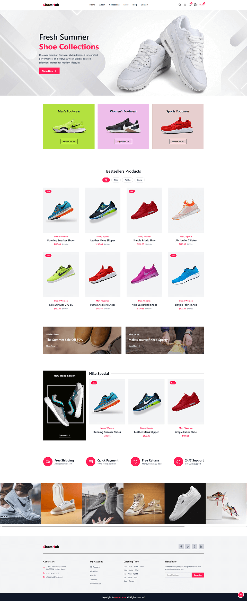

  <h1>Shoes Hub</h1>

  

    <strong>About the Project:</strong>
    ShoesHub is a shoe store UI built with React and Tailwind CSS. It features a clean, modern layout with product listings, brand filtering, collection banners, and a fully responsive design — built to demonstrate clean UI development with modern frontend tools.
  

  

    <strong>Key Highlights:</strong>
    Interactive brand filter, smooth hover effects on product cards, mobile slide-out navigation, and a fully data-driven layout powered by a centralized JSON file.
  

  
<h2>Project Details</h2>

  

    
<h4>What's Inside</h4>

    <ul>
      <li><strong>Header</strong> — Fixed navbar with logo, navigation links, and cart icons.</li>
      <li><strong>Hero Section</strong> — Full-width banner with headline, description, and CTA button.</li>
      <li><strong>Collection Section</strong> — Three scrollable cards for Men, Women, and Sports.</li>
      <li><strong>Products Section</strong> — Filterable grid showing bestseller shoes by brand.</li>
      <li><strong>CTA Section</strong> — Two promotional banners with discount offers and links.</li>
      <li><strong>Special Section</strong> — Side banner with a Nike special products carousel.</li>
      <li><strong>Service Section</strong> — Icons highlighting shipping, payment, returns, and support.</li>
      <li><strong>Instagram Section</strong> — Scrollable image gallery with hover overlay effect.</li>
      <li><strong>Footer</strong> — Brand info, contact details, account links, hours, and newsletter.</li>
    </ul>
  

  

    
<h4>Key Features</h4>

    <ul>
      <li><strong>Brand Filter</strong> — Filter products by All, Nike, Adidas, or Puma instantly.</li>
      <li><strong>Product Card Hover Actions</strong> — Cart, wishlist, view, and compare buttons appear on hover.</li>
      <li><strong>Mobile Navigation</strong> — Slide-out menu with overlay for small screens.</li>
      <li><strong>Sticky Header</strong> — Header gains shadow effect when the page is scrolled down.</li>
      <li><strong>Scroll to Top Button</strong> — Appears after scrolling and smoothly returns to top.</li>
      <li><strong>Centralized JSON Content</strong> — All text, images, and data managed from one file.</li>
      <li><strong>Responsive Layout</strong> — Fully adapts across mobile, tablet, and desktop screens.</li>
    </ul>
  

  

    
<h4>Technologies Used</h4>

    <ul>
      <li><strong>React</strong> — Component-based UI with hooks for state and side effects.</li>
      <li><strong>Vite</strong> — Fast build tool and local development server for React projects.</li>
      <li><strong>Tailwind CSS</strong> — Utility-first CSS framework for responsive and custom styling.</li>
      <li><strong>Lucide React</strong> — Clean, consistent icon library used throughout the UI.</li>
      <li><strong>JSON</strong> — Centralized content file for all sections, products, and settings.</li>
    </ul>
  

  

    
<h4>Project Structure</h4>

    <pre>
shoes-hub/
│
├── public/                      # Product images, banners, collections, Instagram feed, and more
│
├── src/
│   ├── content.json             # Centralized data for products, menu, footer, and sections
│   ├── App.jsx                  # Main component with all sections and state logic
│   ├── main.jsx                 # React DOM render entry point
│   └── globals.css              # Global styles and scrollbar customization
│
├── index.html                   # HTML template with meta tags and favicon
├── package.json                 # Dependencies and build scripts
├── vite.config.js               # Vite configuration file
├── tailwind.config.js           # Tailwind CSS configuration
└── README.md                    # Project documentation
    </pre>
  

  
 
    
<h4>Quick Start</h4>

    <ol>
      <li>
        <strong>Clone the repository:</strong>
        <pre><code>git clone https://github.com/nawazdevx/shoes-hub.git</code></pre>
      </li>

      <li>
        <strong>Navigate to project folder:</strong>
        <pre><code>cd shoes-hub</code></pre>
      </li>

      <li>
        <strong>Install dependencies:</strong>
        <pre><code>npm install</code></pre>
      </li>

      <li>
        <strong>Start development server:</strong>
        <pre><code>npm run dev</code></pre>
        Then visit the local URL shown in terminal (usually <code>http://localhost:5173</code>)
      </li>

      <li>
        <strong>Build for production:</strong>
        <pre><code>npm run build</code></pre>
        Production files will be generated in <code>dist/</code> folder
      </li>
    </ol>

  

 
  <strong>License:</strong>
  This project is licensed under the <a href="https://choosealicense.com/licenses/mit/">MIT License</a>.

 
  <strong>Contact:</strong> 
  Connect with me on <a href="https://www.linkedin.com/in/nawazdevx">LinkedIn</a> or visit my <a href="https://nawazdevx.vercel.app/">Portfolio</a>.

 
  <strong>Support:</strong> 
  Found this helpful? Give it a ⭐ on GitHub! Thank you.

 

  <h2>Project Preview</h2>

  

    <strong>You can view the live project here ➜</strong>
    <a href="https://shoes-nawazdevx.netlify.app/" target="_blank">
      <strong>Live Demo</strong>
    </a>
  

  

